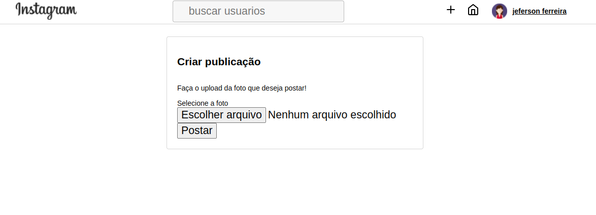

<h1 align="center">
  
</h1>

 <h1 align="center">
   Fake Instagram
 </h1>
 
O Fake instagram é um clone do Instagram, uma rede social onde você pode pode postar suas fotos, curtir postagens de outras pessoas e comentar.
 
## Tecnologias.
 
Aqui estão as tecnologias utilizadas neste projeto.
 
* CSS
* HTML
* JavaScript
* EJS
* BcryptJs
* Express
* Morgan
* Multer
* MySQL
* Sequelize
* Sequelize-cli
* Uuid
 
## Serviços usados.
 
* Github
* Heroku

## Funcionalidades.
 
  - Cadastro de usuário.
  - Login.
  - Postar fotos.
  - Curtir fotos.
  - Comentar posts.
 
## Como usar.
### 1 - Faça login com sua conta. Se não tiver uma, clique em *Cadastre-se*.
 
 
 
### 2 - Fazer um post. Para postar algo, clique no ícone do sinal de '+' no menu, e será direcionado para a aba *Criar publicação*.
 
 
### 3 - Para curtir uma postagem, clique no ícone de coração que aperece no canto inferior esquerdo da postagem. Ou se preferir comentar, clique no campo *Adicionar comentário*, digitar seu comentário e clicar em *Publicar*.
 
 
## Rodando este projeto em sua máquina.

Antes de começar, você vai precisar ter instalado em sua máquina as seguintes ferramentas:
[Git](https://git-scm.com), [Node.js](https://nodejs.org/en/). 
Além disto é bom ter um editor para trabalhar com o código como [VSCode](https://code.visualstudio.com/)

### 🎲 Rodando o Back End (servidor)

```bash
# Clone este repositório
$ git clone <https://github.com/Jefersoncf/fake-instagram>

# Acesse a pasta do projeto no terminal/cmd
$ cd fake-instagram

# Vá para a pasta server
$ cd src

# Instale as dependências
$ npm install

# Execute a aplicação em modo de desenvolvimento
$ npm run start:app

# O servidor inciará na porta:3000 - acesse <http://localhost:3000>
```
 
## Links
 
  - Link da aplicação rodando: (https://fake-instagram-2.herokuapp.com/)
  - Repository: https://github.com/Jefersoncf/fake-instagram
    - No caso de bugs sensíveis, como vulnerabilidades de segurança, entre em contato diretamente com SEU EMAIL em vez de usar o rastreador de problemas. 
     Valorizamos seu esforço para melhorar a segurança e privacidade deste projeto!
 
## Versão
 
1.0.0.0
 
## Author
 
* **Jeferson Ferreira**: @Jefersoncf (https://github.com/Jefersoncf)
 
Por favor, siga o github e junte-se a nós!
Obrigado por me visitar e boa codificação!
